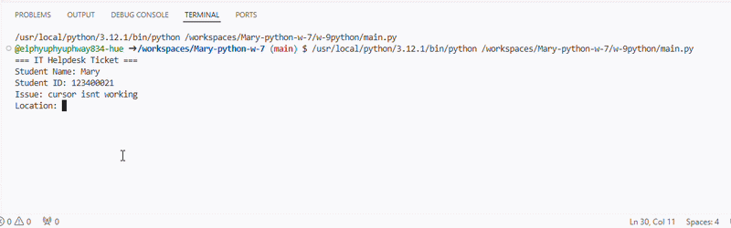

# Ticket Registration System

## Purpose
A simple modular Python program that registers IT helpdesk tickets and assigns technicians based on priority.

## Tech Stack
- Python 3
- Modular Programming

## Files
- main.py
- ticket.py
- display.py

## How to Run

python main.py

## Priority Assignment

High   -> Ahmad
Medium -> Siti
Low    -> Ali

